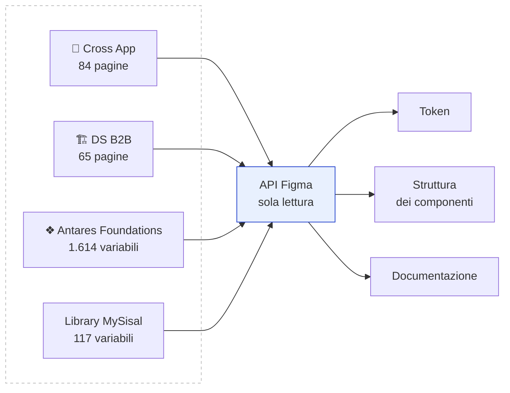
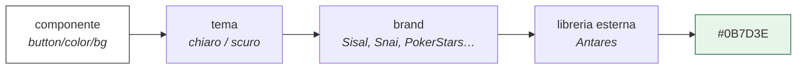
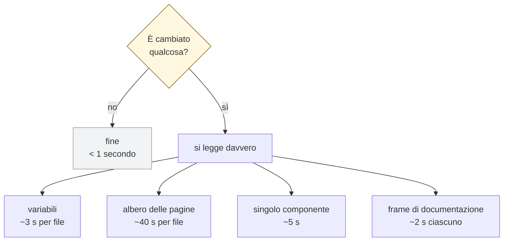
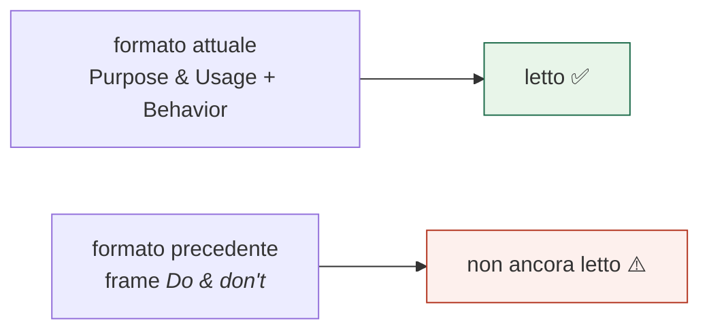
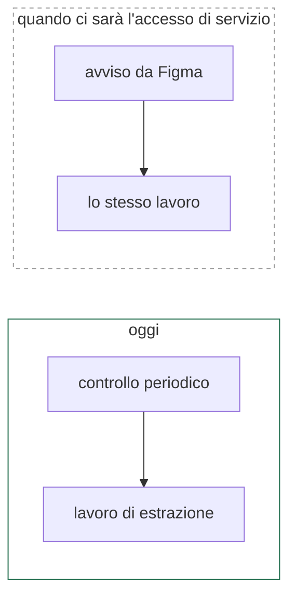
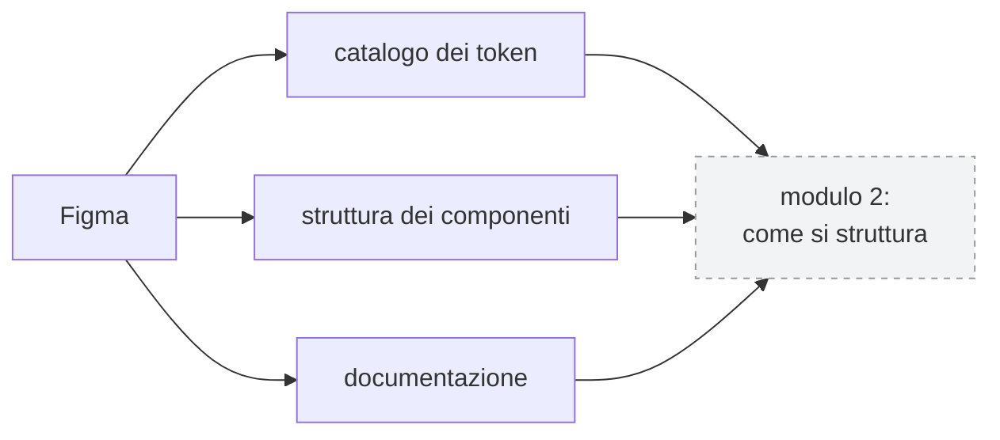

# 1. Raccolta degli input

> Primo di una serie che descrive il sistema un modulo alla volta.
> Qui si risponde a una sola domanda: **da dove arrivano i dati, e come.**
> Cosa ci si fa dopo è nei documenti successivi.

---

## In una frase

Il sistema legge **quattro file Figma** attraverso l'API pubblica di Figma, in
sola lettura, e ne ricava tre tipi di informazione: i **token**, la **struttura
dei componenti**, la **documentazione**.



Nessun accesso in scrittura: il sistema **non modifica mai Figma**.

---

## I quattro file, e perché sono quattro

| File | Contiene | Ruolo |
|---|---|---|
| 📱 **Cross App** | componenti mobile, documentazione | la fonte principale |
| 🏗️ **DS B2B** | componenti web | l'altro design system |
| ❖ **Antares Foundations** | 1.614 variabili | i valori primitivi condivisi |
| **Library MySisal** | 117 variabili | valori specifici di un prodotto |

I primi due sono i design system veri. Gli altri due sono **librerie**: non
contengono componenti, contengono i valori a cui i componenti fanno riferimento.

### Perché i valori non stanno dove stanno i componenti

Un colore non è scritto dentro il bottone. È una catena di rimandi:



Serve perché il design system è **multibrand**: lo stesso bottone deve diventare
verde per Sisal e di un altro colore per Snai, cambiando solo l'ultimo anello.
Il prezzo è che per risolvere un colore bisogna attraversare più file.

**Misurato:** 2.055 variabili risolte su 2.076, con **1.853 salti tra file**.
Confrontando il risultato con il CSS già scritto a mano: **94% di corrispondenza**.
Gli scarti sono conversioni tipografiche che avvengono a valle, non in Figma.

---

## Cosa si legge, con quale chiamata



La domanda iniziale costa **meno di un secondo**: si confronta una data di
ultima modifica. Tutto il resto parte solo se la risposta è sì.

Una passata completa su tutti i componenti: **8-10 minuti**.

---

## I tre tipi di informazione

### Token
I nomi e le catene di rimandi. Si raccolgono i **nomi**, mai i valori risolti:
i valori valgono per un brand alla volta, i nomi valgono per tutti.

### Struttura dei componenti
Dalla tabella delle proprietà di Figma: quali varianti esistono, quali
interruttori, quali testi, quali icone sostituibili, e le dimensioni misurate
sui nodi reali. Non dalla descrizione testuale, che è prosa e sbaglia.

### Documentazione
Dai frame che i designer compilano accanto a ogni componente: scopo, casi d'uso,
anti-pattern, comportamento per piattaforma.

---

## Tre trappole trovate sul campo

Non sono ipotesi: sono errori in cui il sistema è già caduto.

### ① Gli identificativi sono condivisi tra i due file

Il file B2B è stato **duplicato** dal B2C, e Figma conserva gli identificativi
quando si duplica. Lo stesso identificativo restituisce componenti diversi:

```
5473:10855  in Cross App  →  Button,  90 varianti, 11 proprietà
5473:10855  in DS B2B     →  Button, 120 varianti,  9 proprietà
```

Chiedere il componente sbagliato **non produce alcun errore**. Si ottiene un
Button valido, solo che è quello dell'altro design system.

> **Regola:** il design system va sempre indicato esplicitamente, mai dedotto
> dall'identificativo.

### ② La documentazione non ha un formato solo



Il formato attuale copre **37 componenti**. Il precedente esiste su componenti
come Button Group, Card Product e Checkbox, e contiene documentazione vera:
*"Don't overuse special cards on a page. Use one per page."* è un anti-pattern
a tutti gli effetti.

### ③ Scandire poco in profondità nasconde dati

Il primo censimento si fermava a tre livelli. La documentazione del formato
precedente sta a **cinque, sei, sette livelli**. Risultato: metà delle pagine
risultava priva di documentazione quando invece ce l'aveva.

> **Regola:** «non trovato» non significa «non esiste». Va distinto un assente
> da un non cercato abbastanza.

---

## Come si sa che qualcosa è cambiato

Due meccanismi che fanno **lo stesso identico lavoro**, con tempi diversi:



Il controllo periodico funziona **con gli accessi che abbiamo già**. L'avviso
immediato richiede un utenza di servizio Figma che ancora non c'è, ma il lavoro
che scatta è lo stesso: passare dall'uno all'altro non richiede riscritture.

⚠️ Il controllo periodico ha un costo da tenere d'occhio: le esecuzioni si
pagano al minuto anche se durano un secondo. Controllare ogni quarto d'ora
significa circa **2.900 minuti al mese**, che su alcuni piani esaurisce da solo
la quota inclusa. Ogni 30 o 60 minuti è più ragionevole.

---

## Cosa esce da questo modulo



---

## Decisioni ancora aperte

| | Decisione | Perché serve | Chi decide |
|---|---|---|---|
| **A1** | Utenza di servizio Figma | Senza, niente avvisi immediati: si resta al controllo periodico | amministratore Figma |
| **A2** | Frequenza del controllo | Determina il costo mensile delle esecuzioni | noi, con il vincolo del piano |
| **A3** | Quali brand e temi risolvere | Oggi solo Sisal chiaro. Gli altri sono estraibili ma raddoppiano i dati | design system team |
| **A4** | Leggere anche il formato precedente | Sblocca la documentazione di componenti oggi vuoti | noi, mezza giornata |
| **A5** | Come associare componente e identificativo | Oggi si legge da un elenco scritto a mano. Andrebbe ricavato da Figma | noi |
| **A6** | Includere anche il B2B | Il web è un altro design system: stessa pipeline, dati separati | prodotto |

---

## Limiti noti

- **I componenti senza asse dimensionale non producono token.** L'estrattore
  misura i valori sulla dimensione di riferimento; se quell'asse non esiste non
  misura nulla **e non lo segnala**. FAB ne è il caso.
- **L'associazione componente/identificativo** dipende da un elenco mantenuto a
  mano fuori da questo sistema. È l'ultimo legame con la documentazione manuale.
