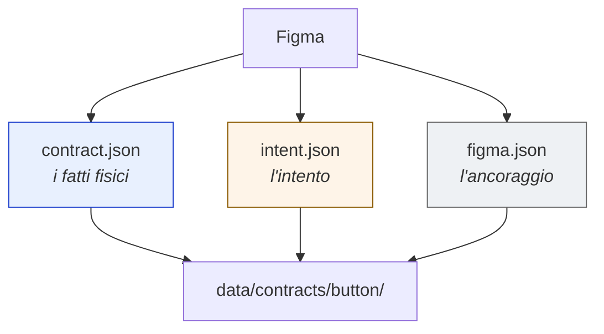
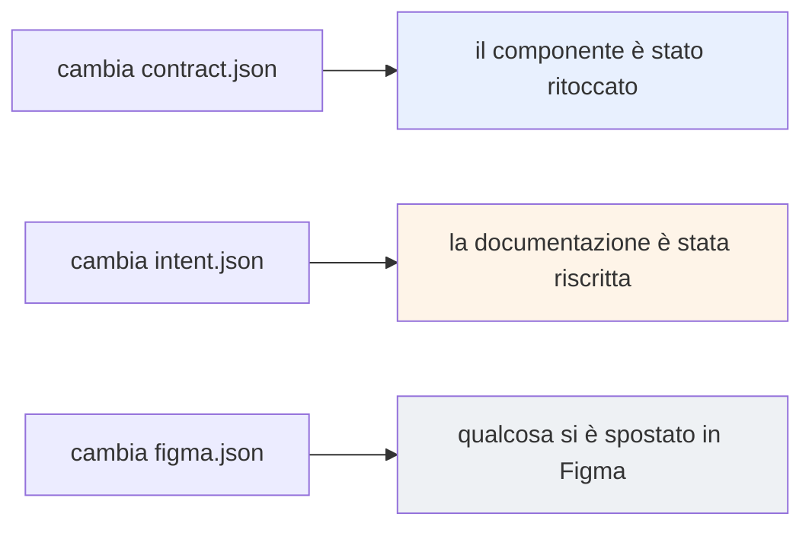
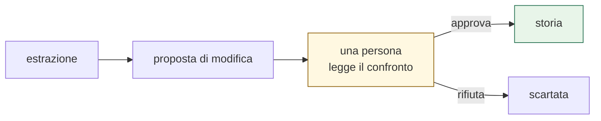

# 2. Struttura dei dati

> Secondo di una serie. Il [modulo 1](01-raccolta-input.md) ha spiegato da dove
> arrivano i dati. Qui si risponde a: **che forma prendono, e perché quella.**

---

## In una frase

Ogni componente diventa **tre file dentro una cartella col suo nome**. Non uno
solo, perché le tre cose cambiano in momenti diversi.



---

## I tre file

| File | Risponde a | Cambia quando |
|---|---|---|
| **contract.json** | *com'è fatto* | si modifica il componente |
| **intent.json** | *a cosa serve, cosa non fare* | si modifica la documentazione |
| **figma.json** | *dove sta* | un nodo si sposta |

### Perché non un file solo

Perché hanno **frequenze diverse**. Il contratto cambia a ogni pubblicazione del
design system; l'ancoraggio quasi mai. Tenerli insieme significherebbe che ogni
modifica di un colore fa apparire come "cambiato" anche il riferimento a Figma,
e chi rivede la modifica non distingue più il rumore dal segnale.

Separati, **ogni file che compare in una modifica dice già di che tipo è**:



---

## Cosa contiene ciascuno

### contract.json — i fatti fisici

Proprietà, varianti, dimensioni, testi, icone sostituibili, e i **nomi** dei
token. Estratti dalla tabella delle proprietà di Figma e dalla geometria dei
nodi reali, non da descrizioni testuali.

Contiene anche una dichiarazione di **quanto è stato effettivamente misurato**:

```
varianti          90
dimensioni        misurate su 2 size su 2
token             45 combinazioni su 45
```

> **Principio: non promettere più di quanto si è misurato.** Un contratto che
> dichiara la propria copertura permette di distinguere "questo componente non
> ha quel dato" da "non siamo riusciti a leggerlo".

⚠️ **Mai valori esadecimali.** Solo nomi di token. Un colore risolto vale per un
brand alla volta; il nome vale per tutti e otto.

### intent.json — l'intento

Scopo, casi d'uso, **anti-pattern**, comportamento per piattaforma. Letto dai
frame che i designer compilano accanto al componente.

Gli anti-pattern sono la parte di maggior valore: sono le regole del tipo *"non
mettere due bottoni primari nella stessa schermata"*, che esistono nella testa
del team ma raramente arrivano a chi implementa.

Include un confronto fra quanto è stato letto da Figma e quanto era scritto a
mano altrove: su Button Icon, **11 anti-pattern estratti contro 4 documentati**.

### figma.json — l'ancoraggio

Dove sta il componente, **un nodo per piattaforma** (Android, iOS, iOS Liquid
Glass), su quale pagina, con quale stato, e quando il file è stato modificato.

È l'unico dei tre che serve *prima* dell'estrazione: dice cosa andare a prendere.

---

## Perché una cartella per componente

```
data/contracts/
├── button/
│   ├── contract.json
│   ├── intent.json
│   └── figma.json
├── button-icon/
└── fab/
```

Invece di `button.contract.json` sparsi in una cartella piatta. Tre ragioni:

1. **Si naviga senza sapere nulla.** Un designer che apre la cartella `button/`
   trova tutto quello che il sistema sa di quel componente.
2. **Si vede subito cosa manca.** Una cartella con due file su tre dichiara da
   sola che l'estrazione è incompleta.
3. **Cresce senza diventare illeggibile.** Con 63 componenti, una cartella piatta
   avrebbe 189 file in fila.

---

## I dati stanno in git, di proposito



Gli artefatti non finiscono in un database: sono **file versionati**. La
conseguenza pratica è che quando qualcosa cambia in Figma, il sistema apre una
proposta e chi la rivede **vede riga per riga cosa è cambiato**, invece di
ricevere un aggiornamento opaco.

E la domanda *"perché questo componente è stato modificato?"* ha una risposta
consultabile: la storia delle modifiche di quella cartella.

### Il prezzo da pagare

Perché questo funzioni, i file devono essere **canonici**: chiavi in ordine
alfabetico, numeri arrotondati, nessuna data dentro il contenuto. Senza questa
disciplina, due estrazioni identiche produrrebbero file diversi e ogni confronto
sarebbe pieno di rumore.

---

## Cosa resta fuori

**I valori risolti dei token.** Esistono e si generano, ma non stanno nella repo
pubblica: sono i colori reali dei brand, cioè materiale aziendale. Il sito non
ne ha bisogno, perché mostra i nomi.

**Il codice generato.** È un modulo a sé, il [numero 4](04-generazione-codice.md).

---

## Decisioni ancora aperte

| | Decisione | Perché serve | Chi decide |
|---|---|---|---|
| **B1** | Dove vivono i valori risolti | Servono per compilare, non per documentare. Repo privata separata? | noi + sicurezza |
| **B2** | Un artefatto per piattaforma o uno solo | Oggi il contratto è unico e l'ancoraggio ha tre nodi. Se iOS e Android divergessero servirebbero tre contratti | design system team |
| **B3** | Cosa fare della documentazione scritta a mano | 63 file esistenti, che l'estrazione dovrebbe sostituire. Si migrano o si affiancano? | design system team |
| **B4** | Quanto indietro tenere la storia | I contratti sono piccoli, ma 63 componenti per anni di modifiche crescono | noi, non urgente |

---

## Limiti noti

- **I componenti senza asse dimensionale non producono token né dimensioni**, e
  non lo segnalano. Il contratto risulta valido ma vuoto. FAB è il caso noto.
- **Il confronto con la documentazione a mano** funziona solo dove quella
  documentazione esiste: sui componenti nuovi manca il termine di paragone.
