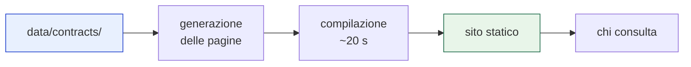
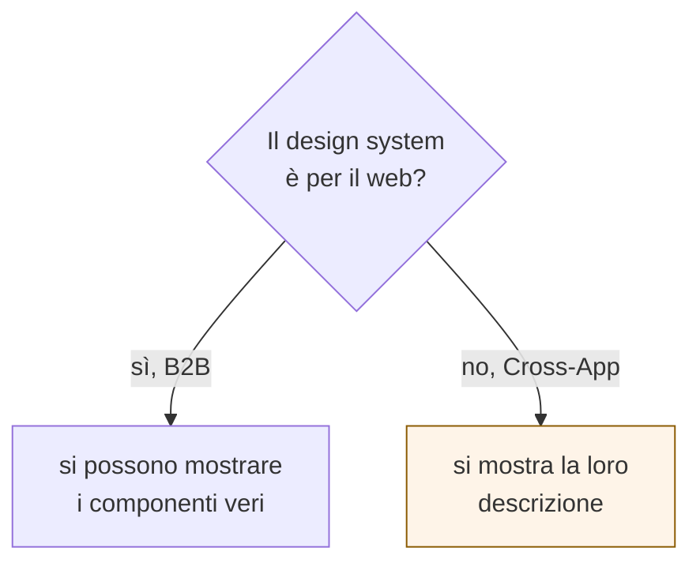
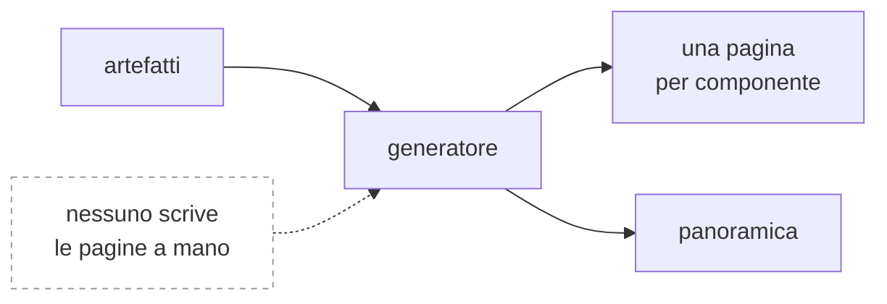
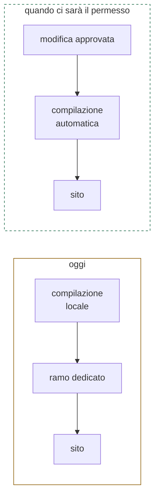
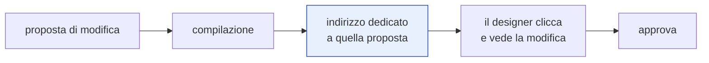

# 3. Pubblicazione

> Terzo di una serie. Il [modulo 2](02-struttura-dei-dati.md) ha spiegato che
> forma prendono i dati. Qui: **come diventano qualcosa che una persona apre.**

---

## In una frase

I dati estratti diventano un **sito consultabile** che nessuno scrive a mano: le
pagine sono generate dagli artefatti, quindi non possono andare fuori sincrono
con Figma.



---

## Perché il sito non renderizza i componenti

Il design system Cross-App è **mobile-native**: iOS, Android, iOS Liquid Glass.
Non esistono componenti web da mostrare in un browser, e non devono esistere.



Quindi il sito è **un sito di documentazione**, non un banco di prova
interattivo. Per un designer che deve capire quando usare un componente e cosa
non fare, è comunque la cosa che serve.

⚠️ Miglioramento previsto: affiancare a ogni pagina **l'immagine del componente
presa da Figma**. Oggi le pagine sono solo testo, e per un designer è poco
leggibile. È mezza giornata di lavoro.

---

## Cosa mostra

### La panoramica

Non è un indice: è la **misura di quanto è coperto**. Per ogni componente si
vede quali dei tre artefatti esistono, quindi quanto di quella pagina si
aggiorna da solo quando il design cambia.

```
componente      artefatti    varianti   proprietà   anti-pattern
Button          C I A            90          9            4
Icon Button     C I A            90          4           11
FAB             C I A             6          2            5
```

Include anche il confronto fra estrazione e documentazione manuale: **dove la
pipeline trova più di quanto era scritto**. È l'argomento più diretto sul perché
il sistema serve.

### La pagina di un componente

Scopo, anti-pattern con il ragionamento completo, comportamento per piattaforma,
proprietà, dimensioni, token, e i collegamenti diretti ai nodi Figma per le tre
piattaforme.

---

## Le pagine sono derivate, non scritte



Le pagine generate **non stanno nella repo**: si riscrivono a ogni compilazione.
Se stessero in repo, esisterebbe una copia che può divergere dalla fonte, ed è
esattamente il problema che il sistema deve eliminare.

> **Scelta tecnica:** le pagine sono costruite dai dati come struttura, non come
> testo. Un anti-pattern scritto in prosa libera può contenere qualsiasi
> carattere; se lo si incollasse dentro un formato testuale, una parentesi
> sbagliata romperebbe la compilazione. Così il testo resta dato.

---

## Come arriva online



**Oggi** il sito si pubblica compilandolo in locale e caricando il risultato su
un ramo dedicato. Funziona subito, ma richiede che qualcuno lo faccia.

**Poi**, con il permesso mancante concesso, la compilazione parte da sola a ogni
modifica approvata: nessuno tocca più nulla.

Il lavoro è lo stesso nei due casi. Cambia solo chi lo avvia.

---

## Chi può vederlo

È la domanda che decide l'ospitalità, e non è tecnica:

| Il design system può essere pubblico? | Allora |
|---|---|
| **Sì** | pubblicazione da GitHub, gratuita, subito |
| **No** | serve un livello di accesso davanti al sito |

⚠️ Attenzione a una trappola: pagare un piano superiore rende possibile
pubblicare da una repo privata, **ma il sito resta pubblico**. L'accesso
riservato ai membri esiste solo sui piani per organizzazioni. Su un account
personale, ogni strada disponibile produce un sito visibile a chiunque.

Se il sito deve essere riservato, la strada è un servizio di ospitalità statica
con davanti l'autenticazione aziendale: mezz'ora di configurazione, gratuita ai
volumi previsti, **e la stessa protezione servirà poi per gli altri servizi**.

---

## L'anteprima per ogni proposta



È la funzione che chiude il cerchio con i designer: invece di leggere un
confronto tra file, si apre un indirizzo e si guarda.

⚠️ La pubblicazione da GitHub **non la offre**: serve un solo sito per
repository, non uno per proposta. È l'argomento più forte a favore di un
servizio di ospitalità esterno, che invece la fornisce nativamente.

---

## Decisioni ancora aperte

| | Decisione | Perché serve | Chi decide |
|---|---|---|---|
| **C1** | Il sito può essere pubblico | Determina tutto il resto dell'ospitalità | responsabile del design system |
| **C2** | Dove ospitarlo | Da C1. Se riservato, serve autenticazione davanti | noi, dopo C1 |
| **C3** | Aggiungere le immagini da Figma | Le pagine oggi sono solo testo | noi, mezza giornata |
| **C4** | Anteprima per ogni proposta | Chiude il ciclo coi designer, ma vincola l'ospitalità | prodotto |
| **C5** | Un sito o due | Cross-App e B2B sono design system diversi | prodotto |

---

## Limiti noti

- **I componenti non si vedono**, per la natura mobile del design system. Le
  immagini da Figma sono il rimedio previsto, non una soluzione completa.
- **Nessuna ricerca testuale** oltre a quella predefinita dello strumento.
- **Il sito mostra solo ciò che è stato estratto**: i componenti non ancora
  passati dalla pipeline non compaiono affatto, e questo può far sembrare il
  design system più piccolo di quello che è.
