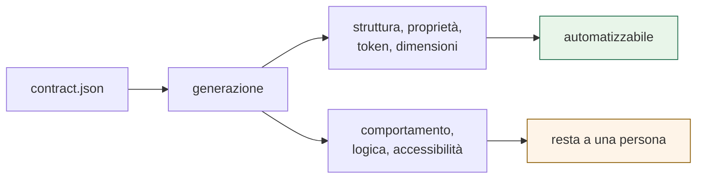
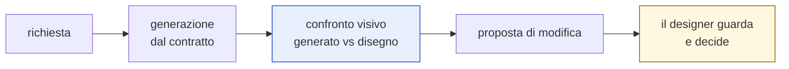
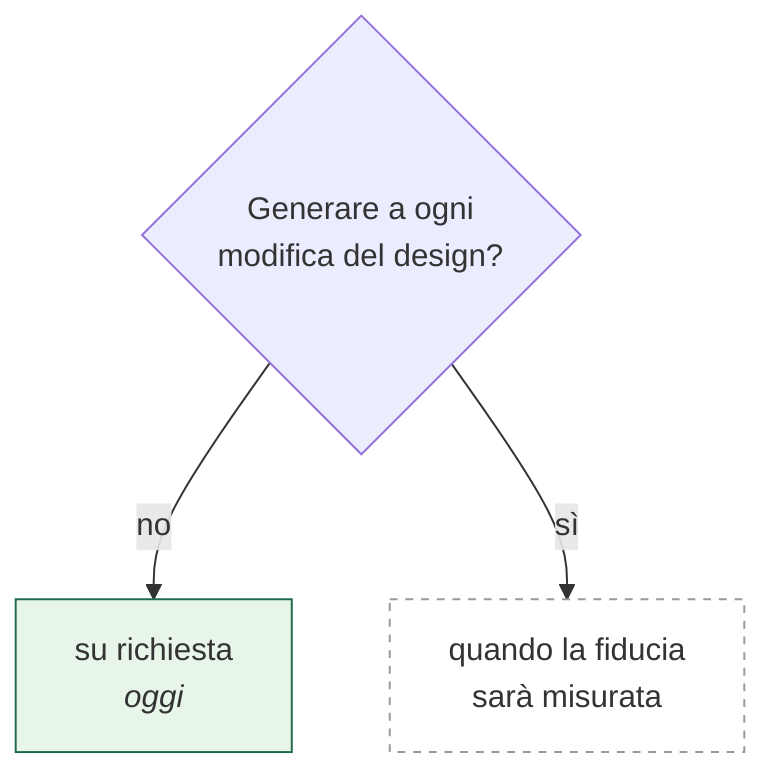
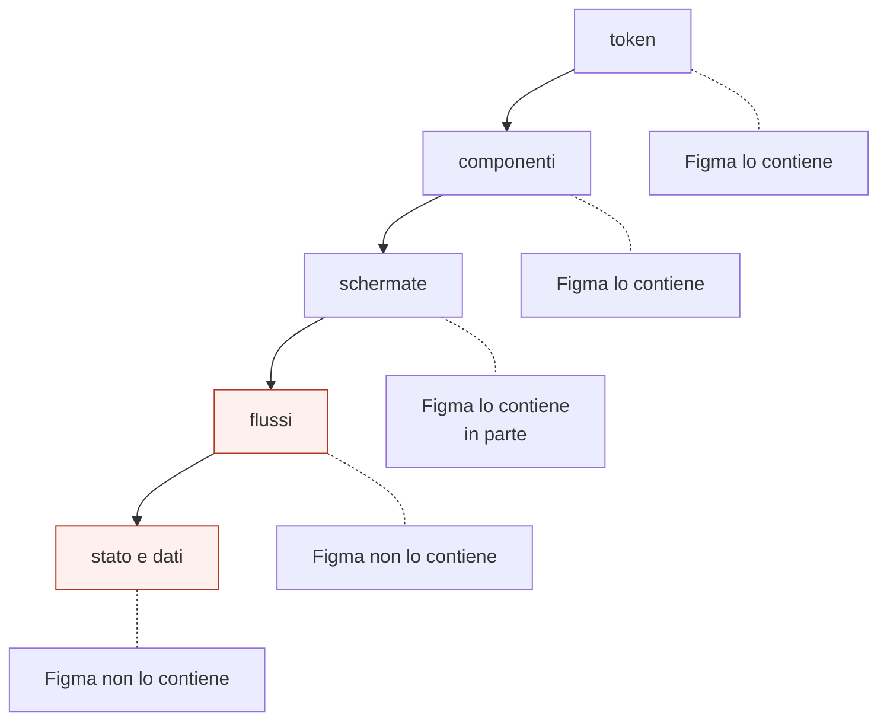

# 4. Generazione di codice

> Quarto di una serie. I moduli [2](02-struttura-dei-dati.md) e
> [3](03-pubblicazione.md) portano il design fino a una documentazione
> consultabile. Qui: **fin dove si arriva verso il codice, e dove ci si ferma.**

---

## In una frase

Il contratto contiene abbastanza informazione per **generare l'impalcatura** di
un componente. Non contiene abbastanza per generarne il comportamento.



Questa distinzione è il cuore del modulo. Confonderla porta a promettere
un'automazione che non può funzionare.

---

## Cosa sa il contratto, e cosa no

| Il contratto sa | Il contratto non sa |
|---|---|
| quali varianti esistono | cosa succede al tocco |
| quali proprietà e i loro valori | come si comporta durante un caricamento |
| quali token per ogni stato | quando disabilitarsi |
| le dimensioni misurate | cosa annunciare a uno screen reader |
| quali testi e icone | come si compone con gli altri |

La colonna di sinistra è **esprimibile sulla tela**: un designer la disegna, e
quindi Figma la contiene. La colonna di destra vive nella testa delle persone e,
in parte, nei frame di documentazione.

> **Principio:** il contratto trasporta solo fatti esprimibili sulla tela. Tutto
> ciò che non lo è deve arrivare da un'altra fonte, o essere scritto a mano.

---

## Cosa è stato verificato

Su un componente reale, generando dal contratto e confrontando con il codice
scritto a mano dal team:

```
token             265 su 265      corrispondono
blocchi di stile   15 su 15       corrispondono
esportazioni        7 su 7        corrispondono
controllo dei tipi   0 errori
```

Il risultato è incoraggiante ma va letto per quello che è: **la parte misurabile
combacia**. Il codice generato non contiene il comportamento, che nel componente
scritto a mano c'è.

⚠️ Va anche detto che quel confronto è stato fatto contro il design system web,
mentre la documentazione arriva da quello mobile. Sono due componenti diversi,
con 90 varianti contro 120.

---

## Il ciclo, quando ci sarà



Il passaggio che rende il ciclo utilizzabile è il **confronto visivo**: mettere
l'immagine di ciò che è stato generato accanto al disegno originale, dentro la
proposta di modifica.

Senza, un designer dovrebbe leggere codice per approvare, e non lo farà.

---

## Dove si ferma, oggi

Il codice si genera **su richiesta esplicita**, non automaticamente a ogni
modifica del design. È deliberato:



Generare automaticamente significa che il design system inizia a produrre
proposte di codice che qualcuno deve rivedere. Finché non si sa **quanto spesso
il generato è corretto**, quel flusso produce lavoro invece di risparmiarlo.

Il criterio per passare all'automatico è misurabile: la percentuale di proposte
approvate senza modifiche.

---

## Oltre l'interfaccia

La domanda che arriva sempre — *"e i flussi? i passaggi tra schermate?"* — ha
una risposta, ma non è questo modulo.



I primi tre livelli si possono ricavare dal design. Gli ultimi due **non stanno
in Figma**: un prototipo mostra che un bottone porta a una schermata, non dice
cosa succede se la chiamata fallisce, chi può accedervi, o cosa si conserva.

Servono da un'altra fonte. È un modulo a sé, non ancora scritto.

---

## Decisioni ancora aperte

| | Decisione | Perché serve | Chi decide |
|---|---|---|---|
| **D1** | Verso quale tecnologia generare | Il web e il mobile richiedono generatori diversi | prodotto |
| **D2** | Quando passare da su richiesta ad automatico | Serve prima misurare quanto spesso il generato è corretto | noi, con un criterio numerico |
| **D3** | Da dove arriva il comportamento | Non sta nel contratto. Frame di documentazione, o scritto a mano | design system team |
| **D4** | Confronto visivo dentro la proposta | È ciò che rende approvabile da un designer | noi, circa una settimana |
| **D5** | Chi possiede il codice generato | Se il generatore riscrive, le modifiche manuali si perdono | sviluppo |

---

## Limiti noti

- **Il confronto col codice esistente richiede un accesso** al repository del
  team, oggi non disponibile. Senza, manca il metro di giudizio.
- **Il generatore produce impalcatura, non componenti finiti.** Presentarlo
  diversamente crea un'aspettativa che il primo tentativo smentisce.
- **Nessuna misura di quanto spesso il generato è corretto**, perché finora è
  stato provato su un componente solo.
