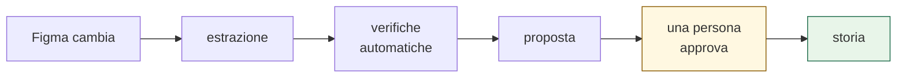
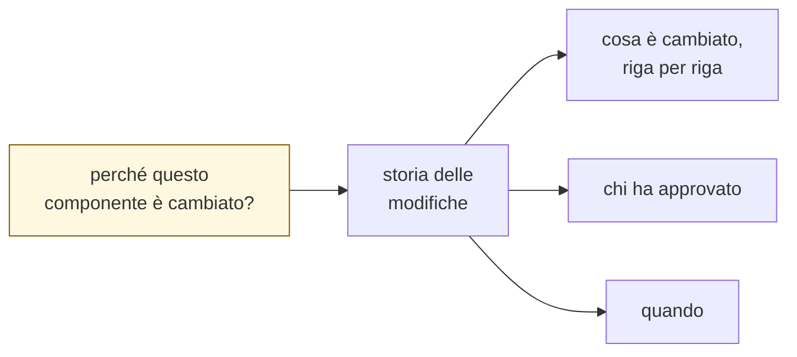
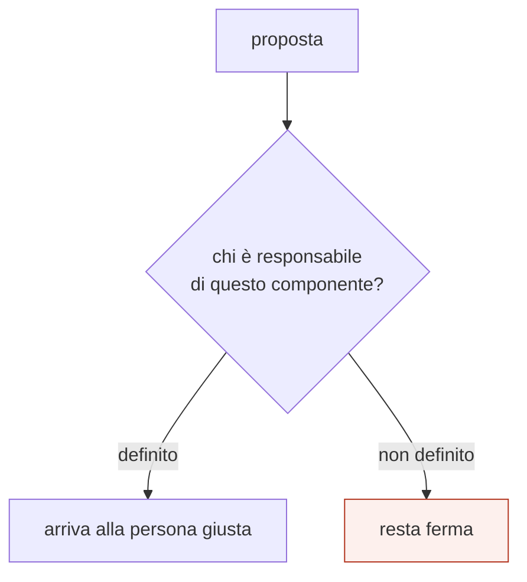
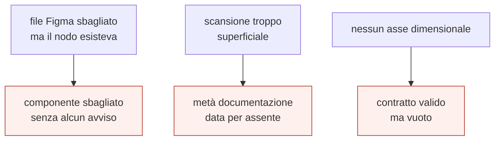

# 5. Controllo e approvazione

> Quinto di una serie. I moduli precedenti descrivono come i dati si muovono.
> Qui: **chi decide che una modifica è valida, e come si ricostruisce il perché.**

---

## In una frase

Il sistema **propone, non decide**. Nessuna modifica entra senza che una persona
l'abbia approvata, e ogni approvazione resta consultabile.

---

## Le verifiche automatiche vengono prima

Prima che una proposta arrivi a una persona, passa da controlli che non
richiedono giudizio:

| Controllo | Cosa impedisce |
|---|---|
| **struttura** | un artefatto malformato |
| **riferimenti** | un token citato che non esiste |
| **nessun valore esadecimale** | un colore fissato a un brand solo |
| **ripetibilità** | due estrazioni identiche che producono file diversi |
| **coerenza nodo/componente** | il componente sbagliato scaricato in silenzio |

L'ultimo nasce da un errore reale: i due file Figma condividono gli
identificativi, quindi chiedere il componente sbagliato restituiva un risultato
valido ma di un altro design system. Ora il nome del nodo viene confrontato con
quello atteso, e se non combaciano l'estrazione si ferma.

> **Principio:** un controllo automatico serve a togliere lavoro alle persone,
> non ad aggiungerne. Se segnala cose che non contano, verrà ignorato, e con
> esso anche quelle che contano.

---

## Il versionamento non è un campo

Non esiste un numero di versione da mantenere: **la storia delle modifiche è il
versionamento**. La domanda *"perché è stato cambiato?"* si risponde guardando
la cartella di quel componente.

Il vantaggio pratico è che nessuno deve ricordarsi di aggiornare un campo. Il
prezzo è che la qualità delle risposte dipende dalla qualità dei messaggi
scritti quando si approva.

---

## Chi approva cosa

È **la decisione aperta più bloccante** dell'intero sistema.

Il meccanismo tecnico esiste ed è standard: si dichiara chi possiede quali
cartelle, e le proposte che le toccano vengono indirizzate automaticamente.

Ma **la mappa non c'è**. Senza, il sistema funziona: apre proposte, esegue
controlli, mostra i confronti. Solo che nessuno è tenuto a guardarle.

⚠️ È l'unico punto in cui il sistema può funzionare tecnicamente e fallire
completamente nella pratica.

---

## Due livelli di approvazione, non uno

Non tutte le modifiche meritano lo stesso attrito:

| Tipo | Esempio | Chi dovrebbe guardare |
|---|---|---|
| **dato estratto** | un colore cambiato in Figma | il responsabile di quel componente |
| **regola del sistema** | un anti-pattern nuovo | il design system team |
| **codice della pipeline** | il generatore | sviluppo |

Trattarli allo stesso modo porta a uno dei due esiti sbagliati: o si approva
tutto senza guardare, o si blocca tutto.

---

## Cosa protegge dagli errori silenziosi

L'esperienza di questo progetto ha prodotto una regola operativa:

> **«Non trovato» non significa «non esiste».**

Tre casi reali, tutti passati inosservati finché qualcuno non ha chiesto *"sei
sicuro?"*:

Hanno una forma comune: **il sistema produce un risultato plausibile invece di
un errore.** Un fallimento rumoroso si nota; uno silenzioso si propaga.

Per questo ogni artefatto dichiara **su quanto è stato misurato**: permette di
distinguere "questo dato non esiste" da "non l'ho letto".

---

## Decisioni ancora aperte

| | Decisione | Perché serve | Chi decide |
|---|---|---|---|
| **E1** | Chi possiede quali componenti | Senza, le proposte non hanno destinatario | design system team |
| **E2** | Quante approvazioni per tipo | Un colore e una regola non pesano uguale | design system team |
| **E3** | Cosa blocca e cosa avvisa soltanto | Un controllo troppo severo verrà aggirato | noi + design system team |
| **E4** | Chi può approvare modifiche alla pipeline | È codice, non dati | sviluppo |

---

## Limiti noti

- **La mappa delle responsabilità non esiste.** Tutto il resto del modulo
  dipende da questa, e non è una decisione tecnica.
- **La qualità della storia dipende da chi scrive** quando approva: il sistema
  registra sempre, ma non può rendere significativo un messaggio vuoto.
- **Nessuna misura di quante proposte vengono approvate senza modifiche**, che
  sarebbe l'indicatore di quanto ci si può fidare dell'automazione.
