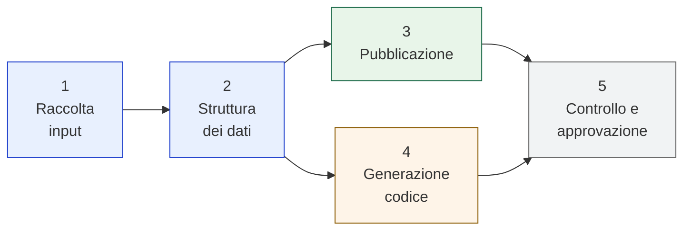

# Architettura del sistema

Cinque moduli, uno per ogni parte. Ognuno risponde a **una domanda sola** e si
legge in pochi minuti, senza aver letto i precedenti.



| | Modulo | Risponde a |
|---|---|---|
| 1 | [Raccolta degli input](01-raccolta-input.md) | Da dove arrivano i dati, e come |
| 2 | [Struttura dei dati](02-struttura-dei-dati.md) | Che forma prendono, e perché quella |
| 3 | [Pubblicazione](03-pubblicazione.md) | Come diventano qualcosa che una persona apre |
| 4 | [Generazione di codice](04-generazione-codice.md) | Fin dove si arriva, e dove ci si ferma |
| 5 | [Controllo e approvazione](05-controllo-e-approvazione.md) | Chi decide che una modifica è valida |

---

## Lo stato in una riga

```
1  Raccolta input       funzionante, provata su dati reali
2  Struttura dati       funzionante, 3 componenti estratti
3  Pubblicazione        funzionante, sito online
4  Generazione codice   provata su un componente, non in uso
5  Controllo            verifiche automatiche presenti, responsabilità da definire
```

---

## Le decisioni aperte, tutte insieme

Ogni modulo ha la sua tabella. Queste sono quelle che **bloccano altro lavoro**:

| | Decisione | Blocca | Chi decide |
|---|---|---|---|
| **C1** | Il sito può essere pubblico | tutta l'ospitalità (modulo 3) | responsabile design system |
| **E1** | Chi possiede quali componenti | l'intero modulo 5 | design system team |
| **A1** | Utenza di servizio Figma | gli avvisi immediati (modulo 1) | amministratore Figma |
| **D3** | Da dove arriva il comportamento | la generazione utile (modulo 4) | design system team |

Le altre sono nelle tabelle dei rispettivi moduli, siglate `A` per il modulo 1,
`B` per il 2, e così via.

---

## Il filo che li lega

Un principio ricorre in tutti e cinque, ed è la lezione più cara pagata finora:

> **Un fallimento silenzioso è peggio di un errore.**

Il file Figma sbagliato che restituiva un componente valido. La scansione troppo
superficiale che dava per assente metà della documentazione. Il componente senza
asse dimensionale che produceva un contratto vuoto ma formalmente corretto.

Tutti e tre hanno prodotto un risultato plausibile invece di un errore, e sono
stati scoperti solo perché qualcuno ha chiesto *"sei sicuro?"*.

Per questo ogni artefatto dichiara su quanto è stato misurato, e ogni controllo
preferisce fermarsi piuttosto che indovinare.
