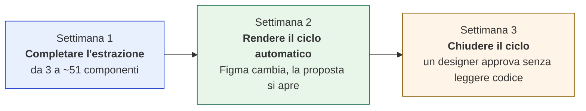
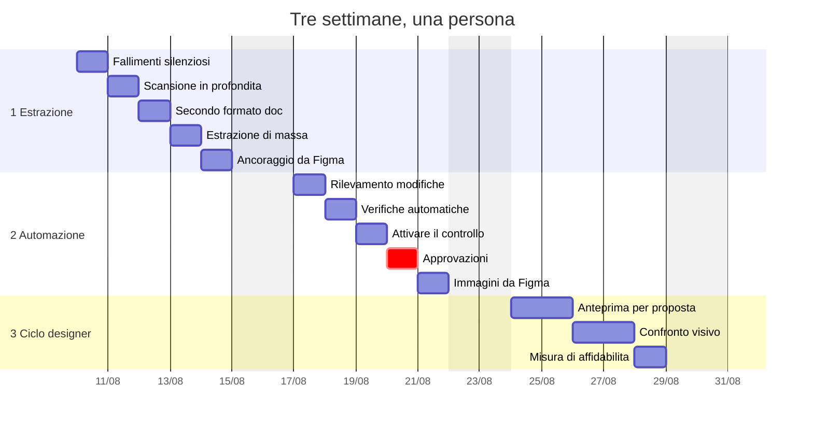
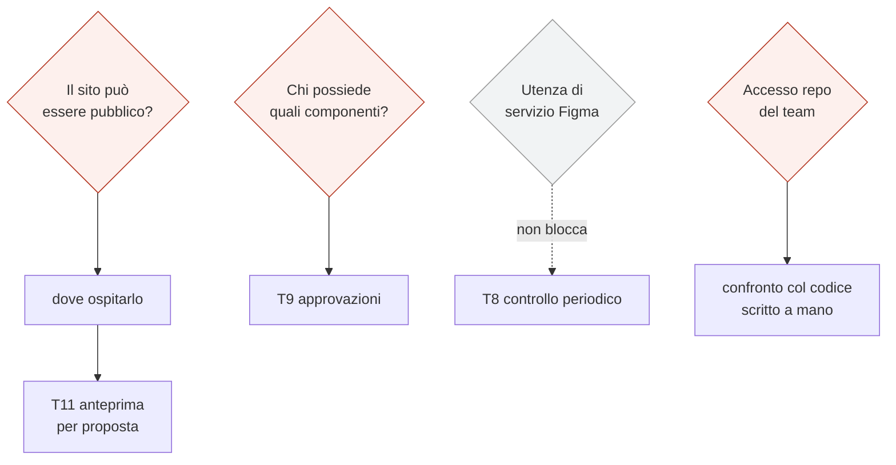

# Piano delle prossime tre settimane

> Ricavato dalle decisioni aperte e dai limiti noti dei
> [cinque moduli di architettura](architettura/README.md).
> **Le stime sono indicative e vanno riviste:** questo documento è pensato per
> essere modificato, non per essere approvato così com'è.

---

## L'obiettivo, in tre passi

Ogni settimana produce qualcosa di utile da sola. Se ci si ferma dopo la prima,
resta comunque un sito che documenta 51 componenti invece di 3.

---

## Diagramma

⚠️ Le date sono un'ipotesi di partenza: vanno spostate sul calendario reale.

---

## Settimana 1 — Completare l'estrazione

**Risultato:** il sito passa da 3 componenti a circa 51, e i dati sono affidabili.

| | Attività | Perché | Effort | Da |
|---|---|---|---|---|
| **T1** | Far fallire rumorosamente i casi vuoti | Un componente senza asse dimensionale produce oggi un contratto valido ma vuoto, in silenzio | **1 g** | limite mod. 2 |
| **T2** | Scandire in profondità l'albero Figma | La scansione si ferma troppo presto e dà per assente metà della documentazione | **1 g** | limite mod. 1 |
| **T3** | Leggere il secondo formato di documentazione | I frame `Do & don't` contengono anti-pattern veri, oggi ignorati | **1 g** | A4 |
| **T4** | Estrazione di massa su tutti i componenti | Oggi si lancia un componente alla volta a mano | **1 g** | — |
| **T5** | Ricavare l'ancoraggio da Figma | Oggi i nodi per piattaforma si leggono da un elenco scritto a mano fuori dal sistema | **1 g** | A5 |

**Totale: 5 giorni.** T1 e T2 vengono per primi di proposito: senza, l'estrazione
di massa produrrebbe dati sbagliati su scala.

---

## Settimana 2 — Rendere il ciclo automatico

**Risultato:** una modifica in Figma apre da sola una proposta, verificata.

| | Attività | Perché | Effort | Da |
|---|---|---|---|---|
| **T6** | Rilevare cosa è cambiato | Una chiamata per file, meno di un secondo: evita di riestrarre tutto ogni volta | **1 g** | mod. 1 |
| **T7** | Verifiche automatiche | Struttura, riferimenti, nessun esadecimale, ripetibilità | **1 g** | mod. 5 |
| **T8** | Attivare il controllo periodico e osservare un ciclo | Da qui in poi nessuno lancia più niente a mano | **1 g** | A2 |
| **T9** | Regole di approvazione | ⚠️ **Bloccata:** serve sapere chi è responsabile di quali componenti | **1 g** | E1 |
| **T10** | Immagini dei componenti da Figma | Le pagine oggi sono solo testo, poco leggibili per un designer | **1 g** | C3 |

**Totale: 5 giorni**, di cui **1 bloccato** da una decisione altrui.

---

## Settimana 3 — Chiudere il ciclo con i designer

**Risultato:** un designer può approvare guardando, senza leggere codice.

| | Attività | Perché | Effort | Da |
|---|---|---|---|---|
| **T11** | Anteprima per ogni proposta | Un indirizzo dedicato che mostra la modifica. È ciò che rende rivedibile il lavoro | **2 g** | C4 |
| **T12** | Confronto visivo generato / disegno | Immagini affiancate dentro la proposta | **2 g** | D4 |
| **T13** | Misurare quanto è affidabile | Percentuale di proposte approvate senza modifiche: è il criterio per automatizzare oltre | **1 g** | D2 |

**Totale: 5 giorni.** T11 dipende da dove sarà ospitato il sito (**C2**), che a
sua volta dipende dalla decisione sulla visibilità (**C1**).

---

## Cosa blocca cosa

| Decisione | Blocca | Effort fermo | Chi decide |
|---|---|---|---|
| **C1** il sito può essere pubblico | T11, e tutta l'ospitalità | 2 g | responsabile design system |
| **E1** chi possiede quali componenti | T9 | 1 g | design system team |
| **accesso alla repo del team** | il confronto col codice esistente | 2 g | IT |
| **A1** utenza di servizio Figma | *nulla nelle 3 settimane* | 0 g | amministratore Figma |

**Totale fermo su decisioni altrui: circa 5 giorni su 15.**

⚠️ Da notare: **A1 non blocca niente in questo periodo.** Il controllo periodico
funziona con gli accessi che abbiamo già; l'utenza di servizio serve solo per
passare da «entro un quarto d'ora» a «immediato», che non è urgente.

---

## Cosa resta fuori, e perché

| | Perché non ora |
|---|---|
| **Generazione automatica di codice** | Prima serve misurare quanto spesso il generato è corretto (T13). Automatizzare senza quel dato produce lavoro invece di risparmiarlo |
| **Il design system B2B** | Stessa pipeline, dati separati. È una decisione di prodotto, non un'estensione tecnica |
| **Flussi, stato, dati** | Non stanno in Figma. Richiedono una fonte diversa e un modulo di architettura ancora da scrivere |
| **Altri brand e temi** | Oggi solo Sisal chiaro. Estrarli è meccanico, ma raddoppia i dati senza un uso immediato |

---

## Come modificare questo piano

Le stime sono a **giornate intere** di proposito: a questo livello di
incertezza, mezze giornate darebbero una precisione che non c'è.

Tre leve, in ordine di impatto:

1. **Togliere la settimana 3.** Il sistema resta utile: estrae, verifica, apre
   proposte. Manca il ciclo di approvazione visiva per i designer.
2. **Spostare T10** (immagini da Figma) in settimana 1. È l'attività che rende
   il sito presentabile, ed è indipendente da tutto il resto.
3. **Anticipare le decisioni bloccanti.** Cinque giorni su quindici dipendono da
   risposte che non arrivano da noi: chiederle adesso vale più di qualsiasi
   ottimizzazione del piano.
